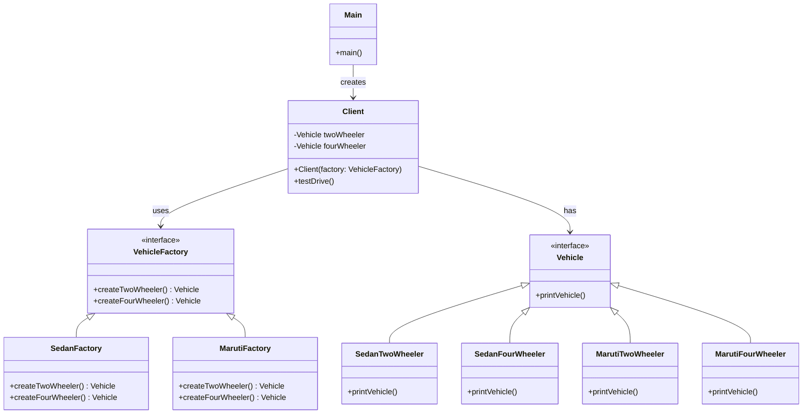

# 📌 Design Pattern: [Abstract Factory]

---

## ✅ 1️⃣ Definition (in your words)

✏️ The Abstract Factory Design Pattern provides an interface for creating families of related or dependent objects without specifying their concrete classes. It centralizes object creation while keeping client code independent of specific types.

---

## 🎯 2️⃣ Intent

- Encapsulate object creation logic
- Allow subclasses or factories to decide which family object to create
- Enables scalability and flexibility in object creation
- Promotes consistency among products in a family (e.g., all UI elements from the same theme)
- Adheres to the **Open/Closed Principle**

---

## ⚙️ 3️⃣ When to Use

- When instantiating classes is complex or dependent on external configuration
- When you want to centralize control over creation logic
- When client code shouldn’t care about the actual family object class

- Example:
    - UI Toolkit (e.g., `DarkThemeFactory`, `LightThemeFactory`)
    - Game asset factories (`AlienFactory`, `RobotFactory`)
    - Car brands (`SedanFactory`, `SUVFactory`)

---

## 🚫 4️⃣ When NOT to Use

- When object creation is simple and unlikely to change and only one type is present
- If it introduces unnecessary abstraction for small-scale code
- If you don’t expect the number of concrete classes to grow
- When product families aren't related or don't need to be enforced together.

---

## 🧩 5️⃣ UML or Sketch

---

## 📝 6️⃣ Tiny Example (Java)

[DesignPatterns/src/main/java/org/concepts/singleton/SingletonClass.java at main · MehtaJatin/DesignPatterns](https://github.com/MehtaJatin/DesignPatterns/blob/main/src/main/java/org/concepts/singleton/SingletonClass.java)

---

---

## 🧠 7️⃣ Reflection

✅ What was tricky?

✅ How does it connect to real projects?

✅ What would you do differently next time?

---

## 📚 8️⃣ References

- 📖 Link 1: Refactoring Guru
- 📖 Link 2: GeeksforGeeks
- 📖 Link 3: Your GitHub snippet