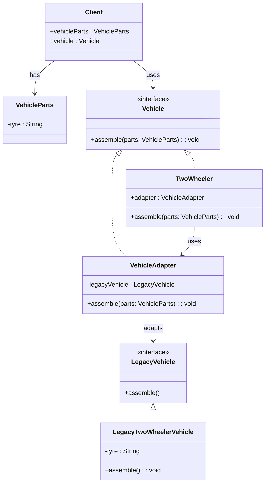

# 📌 Design Pattern: [Adapter]

---

## ✅ 1️⃣ Definition (in your words)

✏️   The Adapter **Pattern** is a structural pattern that allows incompatible interfaces to work together by acting as a bridge between them..

---

## 🎯 2️⃣ Intent

- Make two incompatible interfaces work together without altering their existing code.
- Bridge to work smothly between interfaces without duplicating the business logic

---

## ⚙️ 3️⃣ When to Use

- When two interfaces are incompatible but serving same stuff.
- Legacy or third party library invocation
- Transformation is complex based on adaptee interface

- Example:
    - Legacy libraries and other service invocation

---

## 🚫 4️⃣ When NOT to Use

- When compatible interfaces
- Simple application not require any third party or legacy invocation

---

## 🧩 5️⃣ UML or Sketch

---

## 📝 6️⃣ Tiny Example (Java)

[DesignPatterns/src/main/java/org/concepts/singleton/SingletonClass.java at main · MehtaJatin/DesignPatterns](https://github.com/MehtaJatin/DesignPatterns/blob/main/src/main/java/org/concepts/singleton/SingletonClass.java)

---

---

## 🧠 7️⃣ Reflection

✅ What was tricky?

✅ How does it connect to real projects?

✅ What would you do differently next time?

---

## 📚 8️⃣ References

- 📖 Link 1: Refactoring Guru
- 📖 Link 2: GeeksforGeeks
- 📖 Link 3: Your GitHub snippet