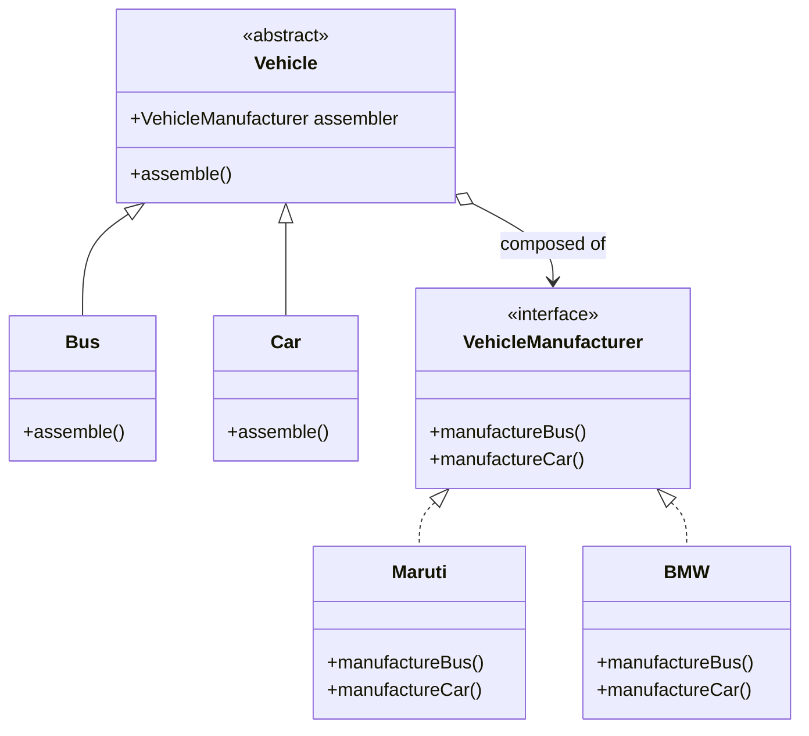

# 📌 Design Pattern: [Bridge]

---

## ✅ 1️⃣ Definition (in your words)

✏️   The **Bridge Design Pattern** is a **structural pattern** that helps **separate abstraction from its implementation**, allowing both to evolve independently.

---

## 🎯 2️⃣ Intent

- Decouple abstraction and implementation so they can vary independently.
- Prefer **composition over inheritance** to reduce tight coupling.
- Useful when there are multiple combinations of classes (e.g., `Vehicle` x `Manufacturer`).

---

## ⚙️ 3️⃣ When to Use

- When abstraction and implementation need to grow or change independently.
- When different implementations should be interchangeable without modifying the abstraction.
- When clients should interact only with the abstraction.

  **Examples:**

    - UI elements vs. rendering APIs (e.g., HTML vs. SVG).
    - Vehicles vs. different assembling mechanisms.

---

## 🚫 4️⃣ When NOT to Use

- When the application has low complexity and only one implementation is needed.
- When the abstraction layer isn't necessary or won’t vary.
- When tight coupling is acceptable.

---

## 🧩 5️⃣ UML or Sketch

---

## 📝 6️⃣ Tiny Example (Java)

[DesignPatterns/src/main/java/org/concepts/singleton/SingletonClass.java at main · MehtaJatin/DesignPatterns](https://github.com/MehtaJatin/DesignPatterns/blob/main/src/main/java/org/concepts/singleton/SingletonClass.java)

---

---

## 🧠 7️⃣ Reflection

✅ What was tricky?

✅ How does it connect to real projects?

✅ What would you do differently next time?

---

## 📚 8️⃣ References

- 📖 Link 1: Refactoring Guru
- 📖 Link 2: GeeksforGeeks
- 📖 Link 3: Your GitHub snippet