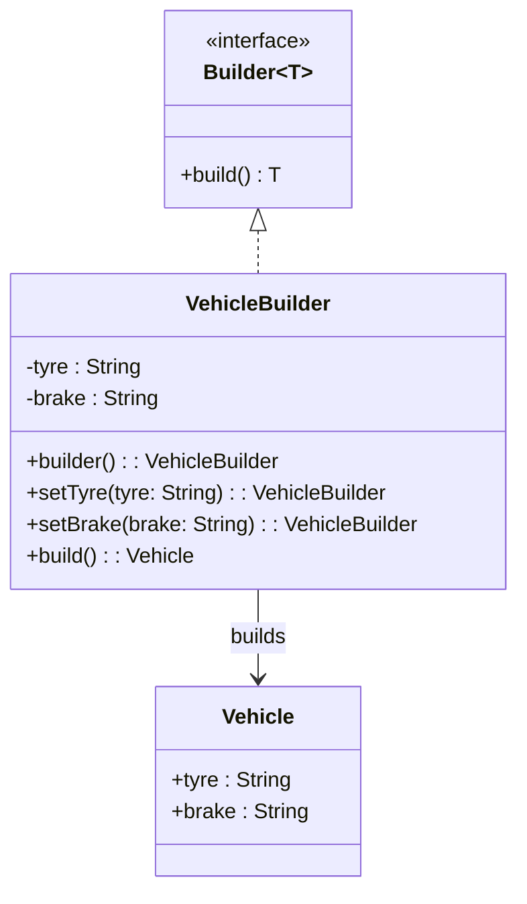

# 📌 Design Pattern: [Builder]

---

## ✅ 1️⃣ Definition (in your words)

✏️   The Builder Pattern is a **creational design pattern** used to construct **complex objects step by step**, especially when an object has **optional fields** or requires **controlled construction** through dedicated methods.

---

## 🎯 2️⃣ Intent

- Encapsulate object creation logic outside the product class
- Delegate the step-by-step construction to a **separate builder class**
- Improve scalability and flexibility in object creation
- Adhere to the **Single Responsibility** and **Open/Closed** principles

---

## ⚙️ 3️⃣ When to Use

- When object construction is **complex** or has many **optional configurations**
- When you want to avoid **constructor overloading hell**
- When client code shouldn’t care about the internal construction logic

- Example:
    - Configurable `Vehicle` objects
    - Building UI elements (e.g., Swing/AWT)
    - Building HTTP requests (`Request.Builder` in OkHttp)

---

## 🚫 4️⃣ When NOT to Use

- When object creation is **simple and static**
- When only one configuration exists
- When the added abstraction makes the code **over-engineered** for small models

---

## 🧩 5️⃣ UML or Sketch

---

## 📝 6️⃣ Tiny Example (Java)

[DesignPatterns/src/main/java/org/concepts/singleton/SingletonClass.java at main · MehtaJatin/DesignPatterns](https://github.com/MehtaJatin/DesignPatterns/blob/main/src/main/java/org/concepts/singleton/SingletonClass.java)

---

---

## 🧠 7️⃣ Reflection

✅ What was tricky?

✅ How does it connect to real projects?

✅ What would you do differently next time?

---

## 📚 8️⃣ References

- 📖 Link 1: Refactoring Guru
- 📖 Link 2: GeeksforGeeks
- 📖 Link 3: Your GitHub snippet