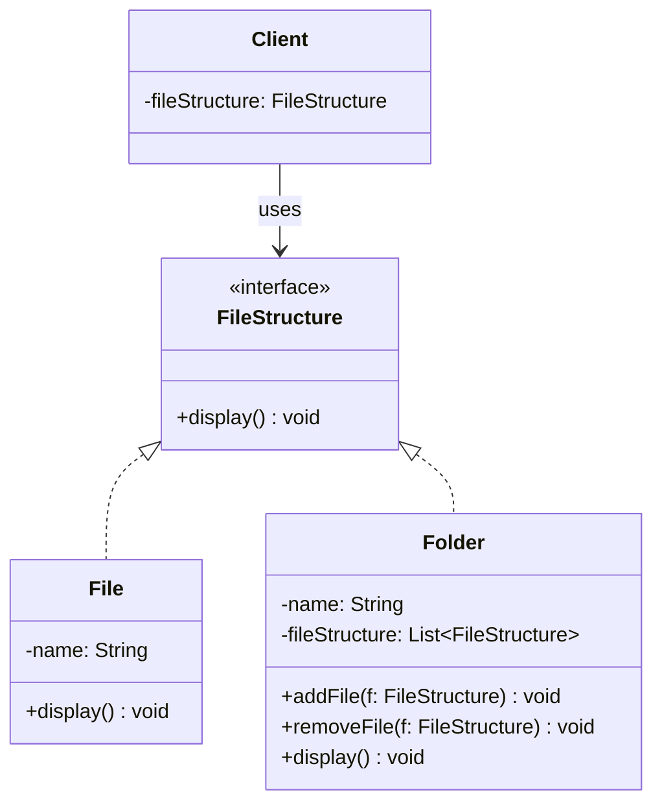

# 📌 Design Pattern: [Composite]

---

## ✅ 1️⃣ Definition (in your words)

✏️   The **Composite Design Pattern** is a **structural pattern** that lets us compose objects into **tree-like structures** to represent **part-whole hierarchies**.

It allows clients to treat **individual objects** and **compositions of objects** **uniformly**.

---

## 🎯 2️⃣ Intent

- Treat **simple** (leaf) and **composite** (group) objects **uniformly**
- Model **hierarchical** tree structures with ease

---

## ⚙️ 3️⃣ When to Use

- When the system has a **hierarchical structure**
- When **client code** should not care whether it’s dealing with a **leaf** or a **composite**
- Examples:
    - UI elements like shapes, windows, buttons
    - File systems (folders containing files or other folders)

---

## 🚫 4️⃣ When NOT to Use

- When the object model is **flat** (non-hierarchical)
- When you don’t need **uniform treatment** of groups and individual objects
- If adding composite behavior increases **unnecessary complexity**

---

## 🧩 5️⃣ UML or Sketch

---

## 📝 6️⃣ Tiny Example (Java)

[DesignPatterns/src/main/java/org/concepts/singleton/SingletonClass.java at main · MehtaJatin/DesignPatterns](https://github.com/MehtaJatin/DesignPatterns/blob/main/src/main/java/org/concepts/singleton/SingletonClass.java)

---

---

## 🧠 7️⃣ Reflection

✅ What was tricky?

✅ How does it connect to real projects?

✅ What would you do differently next time?

---

## 📚 8️⃣ References

- 📖 Link 1: Refactoring Guru
- 📖 Link 2: GeeksforGeeks
- 📖 Link 3: Your GitHub snippet