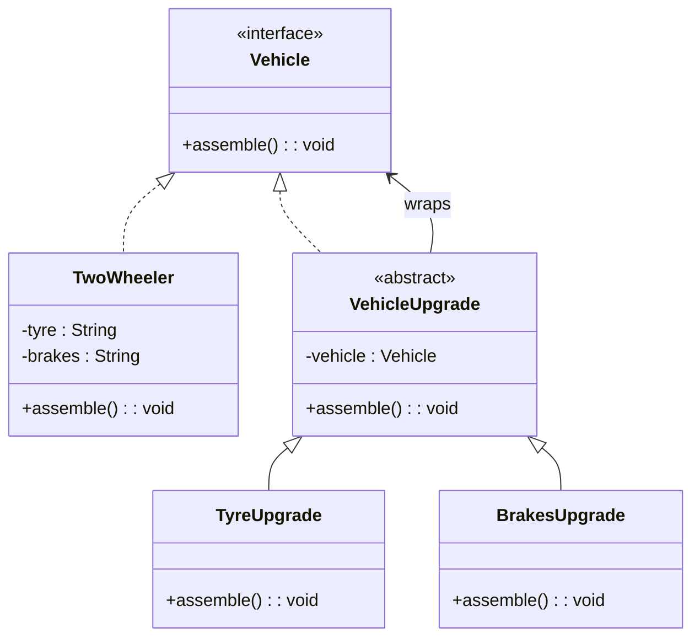

# 📌 Design Pattern: [Decorator]

---

## ✅ 1️⃣ Definition (in your words)

✏️   The **Decorator Pattern** is a structural pattern that allows an object to add new optional features dynamically, without modifying its original class

---

## 🎯 2️⃣ Intent

- Enrich object behavior without altering original logic.
- Enable flexible, runtime extension of features.

---

## ⚙️ 3️⃣ When to Use

- When optional and add on features and functionality available
- Open closed principle - added runtime options without effecting existing behaviour

- Example:
    - GUI components (e.g., `Window`, `BorderDecorator`, `ScrollDecorator`)
    - Java I/O streams (`InputStream`, `BufferedInputStream`, `DataInputStream`)
    - Adding features to messages or UI widgets dynamically

---

## 🚫 4️⃣ When NOT to Use

- When creating a lot of complexity
- No runtime functionality required

---

## 🧩 5️⃣ UML or Sketch

---

## 📝 6️⃣ Tiny Example (Java)

[DesignPatterns/src/main/java/org/concepts/singleton/SingletonClass.java at main · MehtaJatin/DesignPatterns](https://github.com/MehtaJatin/DesignPatterns/blob/main/src/main/java/org/concepts/singleton/SingletonClass.java)

---

---

## 🧠 7️⃣ Reflection

✅ What was tricky?

✅ How does it connect to real projects?

✅ What would you do differently next time?

---

## 📚 8️⃣ References

- 📖 Link 1: Refactoring Guru
- 📖 Link 2: GeeksforGeeks
- 📖 Link 3: Your GitHub snippet