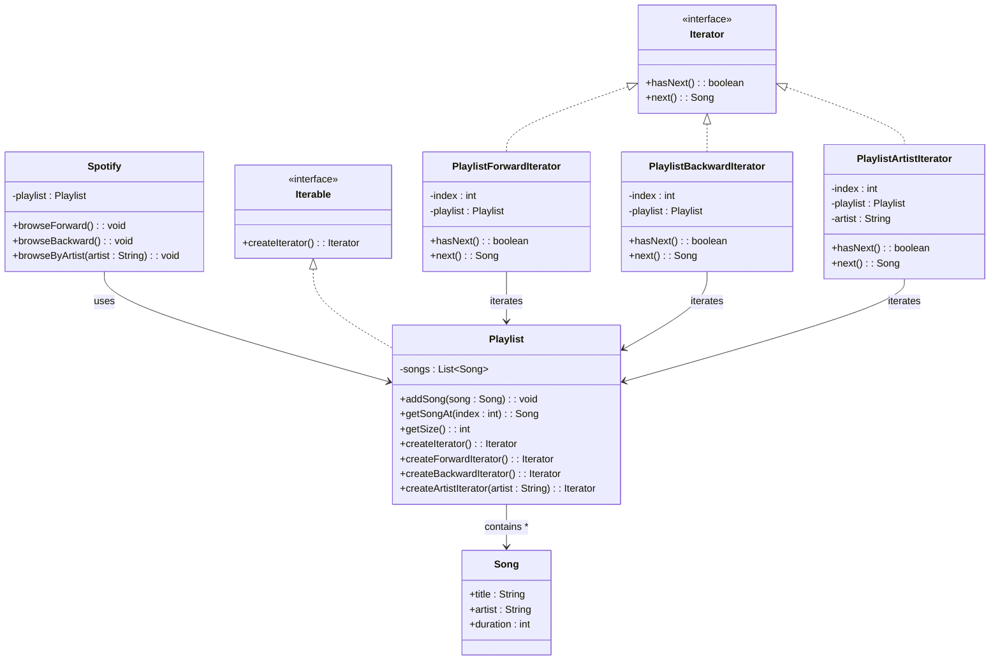

# 📌 Design Pattern: [Iterator]

---

## ✅ 1️⃣ Definition (in your words)

✏️  The **Iterator Pattern** is a **behavioral design pattern** that allows sequential access to elements of a collection **without exposing its internal structure**, while keeping the **iterator and the collection decoupled**.

---

## 🎯 2️⃣ Intent

- Decouple the **traversal logic** (iterator) from the **collection** (iterable).
- Provide a **consistent interface** for iteration, regardless of collection type.
- Support **multiple traversal strategies** (forward, backward, filtered, etc.) without modifying the collection class (Open–Closed Principle).

---

## ⚙️ 3️⃣ When to Use

- When you need to traverse a collection in **different ways** (forward, backward, filtered, random).
- When you want to **hide the collection’s internal structure** from clients.
- When the same client code should work across different collection types.

📌 Example: A **playlist** in a music app can be traversed normally, reversed, or filtered by artist/duration.

---

## 🚫 4️⃣ When NOT to Use

- When the collection has **only one simple traversal requirement**.
- When adding iterators would **overcomplicate a straightforward design**.
- For **very small collections**, where a plain loop is simpler and clearer.

---

## 🧩 5️⃣ UML or Sketch

## **Problem:**  Real-Time Problem Statement: **Custom Playlist Iterator**

Imagine you are building a **music streaming app** (like Spotify).

- A user has a **playlist** of songs.
- Each song has fields: `title`, `artist`, `duration`.
- You want to provide **different ways of iterating** over the playlist:
    1. **Normal order** (first → last).
    2. **Reverse order** (last → first).
    3. **Only songs of a particular artist**.

---

---

---

## 📝 6️⃣ Tiny Example (Java)

[DesignPatterns/src/main/java/org/concepts/singleton/SingletonClass.java at main · MehtaJatin/DesignPatterns](https://github.com/MehtaJatin/DesignPatterns/blob/main/src/main/java/org/concepts/singleton/SingletonClass.java)

---

---

## 🧠 7️⃣ Reflection

✅ What was tricky?

✅ How does it connect to real projects?

✅ What would you do differently next time?

---

## 📚 8️⃣ References

- 📖 Link 1: Refactoring Guru
- 📖 Link 2: GeeksforGeeks
- 📖 Link 3: Your GitHub snippet