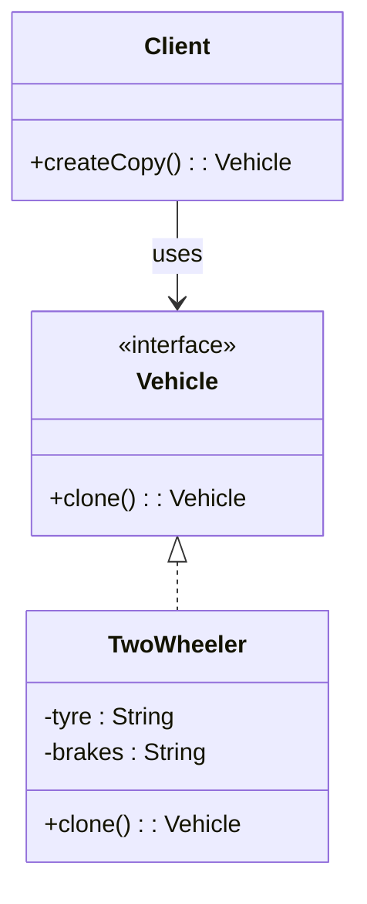

# 📌 Design Pattern: [Prototype]

---

## ✅ 1️⃣ Definition (in your words)

✏️   The **Prototype Pattern** is a creational design pattern used to construct resource- and time-consuming objects by cloning existing ones.

---

## 🎯 2️⃣ Intent

- Avoid costly re-instantiation by cloning existing objects
- Enables efficient duplication of objects with shared structure
- Decouple client code from complex creation logic

---

## ⚙️ 3️⃣ When to Use

- When object creation is time and resource consuming and need only slight modification

- Example:
    - Configurable different `Vehicle` objects
    - Building UI elements (e.g., Swing/AWT)
    - Defining layouts , formats

---

## 🚫 4️⃣ When NOT to Use

- When object creation is **simple and static**
- Does not take much resources and time
- No variation and immutable

---

## 🧩 5️⃣ UML or Sketch

---

## 📝 6️⃣ Tiny Example (Java)

[DesignPatterns/src/main/java/org/concepts/singleton/SingletonClass.java at main · MehtaJatin/DesignPatterns](https://github.com/MehtaJatin/DesignPatterns/blob/main/src/main/java/org/concepts/singleton/SingletonClass.java)

---

---

## 🧠 7️⃣ Reflection

✅ What was tricky?

✅ How does it connect to real projects?

✅ What would you do differently next time?

---

## 📚 8️⃣ References

- 📖 Link 1: Refactoring Guru
- 📖 Link 2: GeeksforGeeks
- 📖 Link 3: Your GitHub snippet