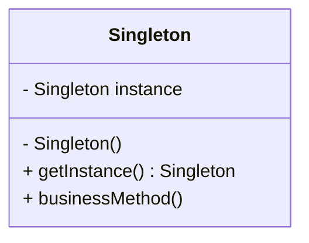

# 📌 Design Pattern: [Singleton]

---

## ✅ 1️⃣ Definition (in your words)

✏️ Ensure a class has **only one instance**, and provide a **global point of access** to it.

---

## 🎯 2️⃣ Intent

- Controls object creation so there’s exactly **one shared instance**.
- Useful for **shared resources** — config managers, loggers, cache, DB connection pools.
- Follows **Single Responsibility** (manage only its own instance) and **Global Access** safely.

---

## ⚙️ 3️⃣ When to Use

- Only one instance is needed to coordinate actions.
- Shared resource that must be consistent across threads/modules.
- Example:
    - Logger
    - Application config
    - Connection pool

---

## 🚫 4️⃣ When NOT to Use

- If multiple instances are acceptable (e.g., multi-tenant).
- When global state can cause tight coupling.
- Makes unit testing tricky if not handled carefully (can hide dependencies).

---

## 🧩 5️⃣ UML or Sketch

---

## 📝 6️⃣ Tiny Example (Java)

[DesignPatterns/src/main/java/org/concepts/singleton/SingletonClass.java at main · MehtaJatin/DesignPatterns](https://github.com/MehtaJatin/DesignPatterns/blob/main/src/main/java/org/concepts/singleton/SingletonClass.java)

---

---

## 🧠 7️⃣ Reflection

✅ What was tricky?

✅ How does it connect to real projects?

✅ What would you do differently next time?

---

## 📚 8️⃣ References

- 📖 Link 1: Refactoring Guru
- 📖 Link 2: GeeksforGeeks
- 📖 Link 3: Your GitHub snippet