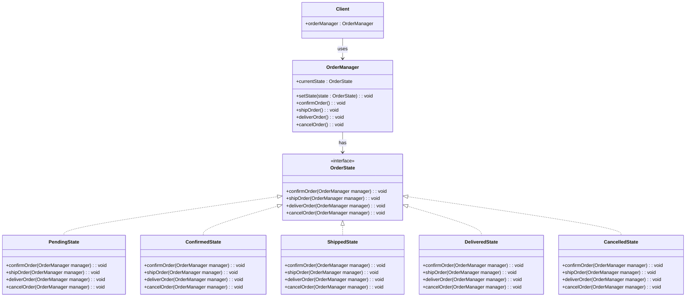

# 📌 Design Pattern: [State]

---

## ✅ 1️⃣ Definition (in your words)

✏️  TThe **State Pattern** is a **behavioral design pattern** that allows an object to **change its behavior when its internal state changes**.

Each state is represented as a separate class, encapsulating the behavior associated with that state.

---

## 🎯 2️⃣ Intent

- Decouple different states of an object.
- Allow behavior to change **dynamically at runtime** based on the object’s current state.
- Encapsulate state-specific behavior in **separate classes**, avoiding complex conditional logic.

---

## ⚙️ 3️⃣ When to Use

- When an object has **multiple states**.
- When the object’s behavior changes depending on its current state.
- Examples: **Vending machine**, **traffic lights**, **online order system**.

---

## 🚫 4️⃣ When NOT to Use

- When the states are **fixed and won’t change**.
- When applying the pattern would **unnecessarily complicate simple code**.

---

## 🧩 5️⃣ UML or Sketch

## **Problem: Online Order Management System**

### **Scenario**

You are building an **e-commerce order system**.

- Each `Order` can be in one of several states:
    - `Pending` → Order placed but not yet confirmed
    - `Confirmed` → Payment received, preparing shipment
    - `Shipped` → Order shipped to customer
    - `Delivered` → Order delivered
    - `Cancelled` → Order cancelled
- Each state has **different behavior** for certain actions:
    - `cancelOrder()` → Only allowed in `Pending` or `Confirmed`.
    - `shipOrder()` → Only allowed in `Confirmed`.
    - `deliverOrder()` → Only allowed in `Shipped`.
    - `confirmOrder()` → Only allowed in `Pending`.
- The system should allow **dynamic state transitions** without putting conditional logic all over the `Order` class.

---

---

---

## 📝 6️⃣ Tiny Example (Java)

[DesignPatterns/src/main/java/org/concepts/singleton/SingletonClass.java at main · MehtaJatin/DesignPatterns](https://github.com/MehtaJatin/DesignPatterns/blob/main/src/main/java/org/concepts/singleton/SingletonClass.java)

---

---

## 🧠 7️⃣ Reflection

✅ What was tricky?

✅ How does it connect to real projects?

✅ What would you do differently next time?

---

## 📚 8️⃣ References

- 📖 Link 1: Refactoring Guru
- 📖 Link 2: GeeksforGeeks
- 📖 Link 3: Your GitHub snippet