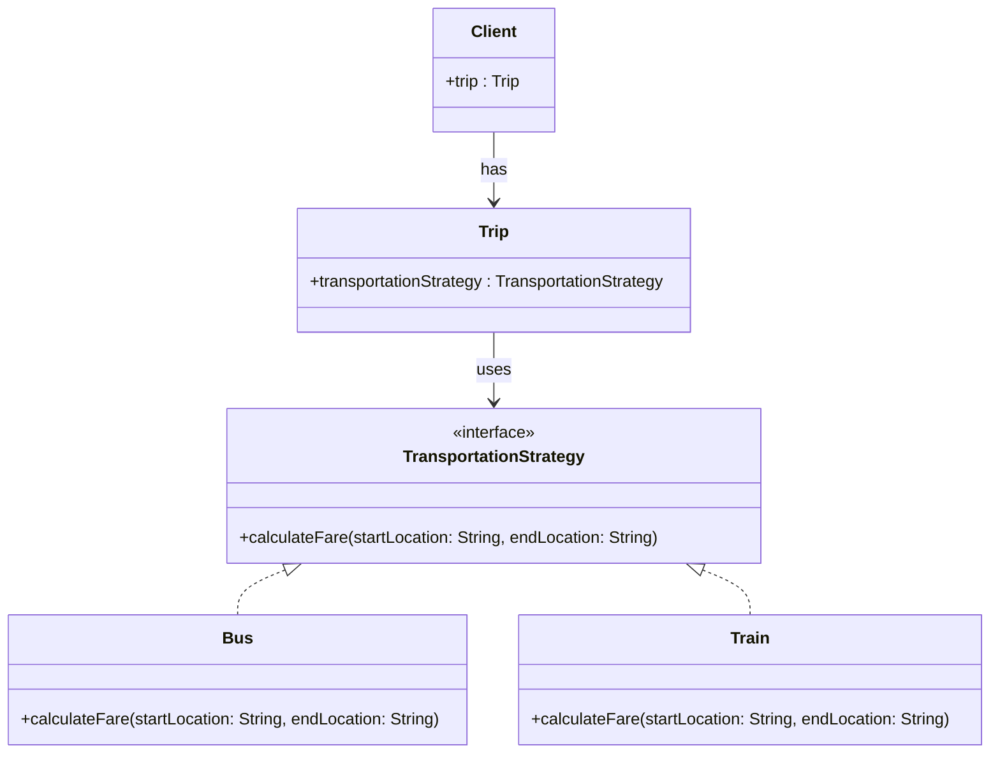

# 📌 Design Pattern: [**Strategy**]

---

## ✅ 1️⃣ Definition (in your words)

✏️   The **Strategy Pattern** is a **behavioral design pattern** that allows you to encapsulate multiple algorithms (strategies) and bind them at runtime based on client needs.

---

## 🎯 2️⃣ Intent

- Enable binding of different strategies **at runtime**
- Encapsulate related algorithms behind a **common interface**
- Promote **flexibility** and **interchangeability** of logic

---

## ⚙️ 3️⃣ When to Use

- When there are **multiple ways** to perform an operation (e.g., different fare calculations)
- When you want to **decouple** algorithm selection from the client
- When **runtime behavior** needs to change dynamically

---

## 🚫 4️⃣ When NOT to Use

- There's **only one fixed algorithm**
- **Runtime binding** or **encapsulation** is unnecessary
- It would **add unnecessary complexity** in simple scenarios

---

## 🧩 5️⃣ UML or Sketch

---

## 📝 6️⃣ Tiny Example (Java)

[DesignPatterns/src/main/java/org/concepts/singleton/SingletonClass.java at main · MehtaJatin/DesignPatterns](https://github.com/MehtaJatin/DesignPatterns/blob/main/src/main/java/org/concepts/singleton/SingletonClass.java)

---

---

## 🧠 7️⃣ Reflection

✅ What was tricky?

✅ How does it connect to real projects?

✅ What would you do differently next time?

---

## 📚 8️⃣ References

- 📖 Link 1: Refactoring Guru
- 📖 Link 2: GeeksforGeeks
- 📖 Link 3: Your GitHub snippet