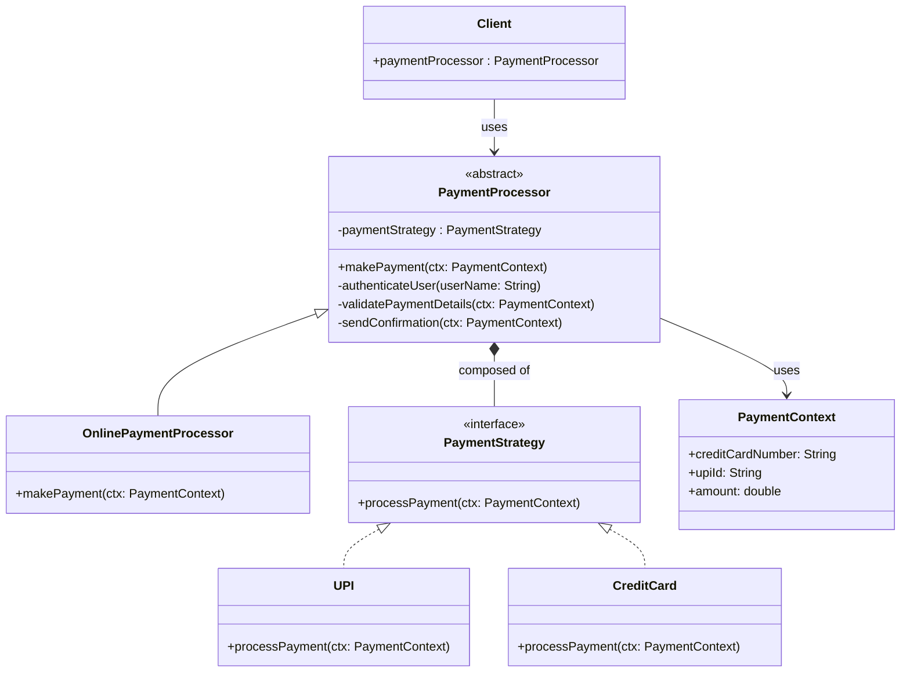

# 📌 Design Pattern: [Template]

---

## ✅ 1️⃣ Definition (in your words)

✏️   The **Template Method Pattern** is a behavioral design pattern that defines the **skeleton of an algorithm** in a base class and allows subclasses (or delegated strategies) to override specific steps without changing the overall structure.

---

## 🎯 2️⃣ Intent

- Enable common code on an abstract layer
- Reusebility of the code
- Single point of interaction  for client through template

---

## ⚙️ 3️⃣ When to Use

- When there is a **fixed sequence of steps**, but some steps vary.
- When you want to **reuse** the common steps across multiple implementations.
- When the **varying steps** have **multiple alternative implementations** — combine with **Strategy Pattern**.

---

## 🚫 4️⃣ When NOT to Use

- There's **only fixed algorithm or steps**
- It would **add unnecessary complexity** in simple scenarios

---

## 🧩 5️⃣ UML or Sketch

You are building an **online shopping platform** where users can pay via **different payment methods**:

- Credit Card
- PayPal
- Google Pay

---

## 📝 6️⃣ Tiny Example (Java)

[DesignPatterns/src/main/java/org/concepts/singleton/SingletonClass.java at main · MehtaJatin/DesignPatterns](https://github.com/MehtaJatin/DesignPatterns/blob/main/src/main/java/org/concepts/singleton/SingletonClass.java)

---

---

## 🧠 7️⃣ Reflection

✅ What was tricky?

✅ How does it connect to real projects?

✅ What would you do differently next time?

---

## 📚 8️⃣ References

- 📖 Link 1: Refactoring Guru
- 📖 Link 2: GeeksforGeeks
- 📖 Link 3: Your GitHub snippet