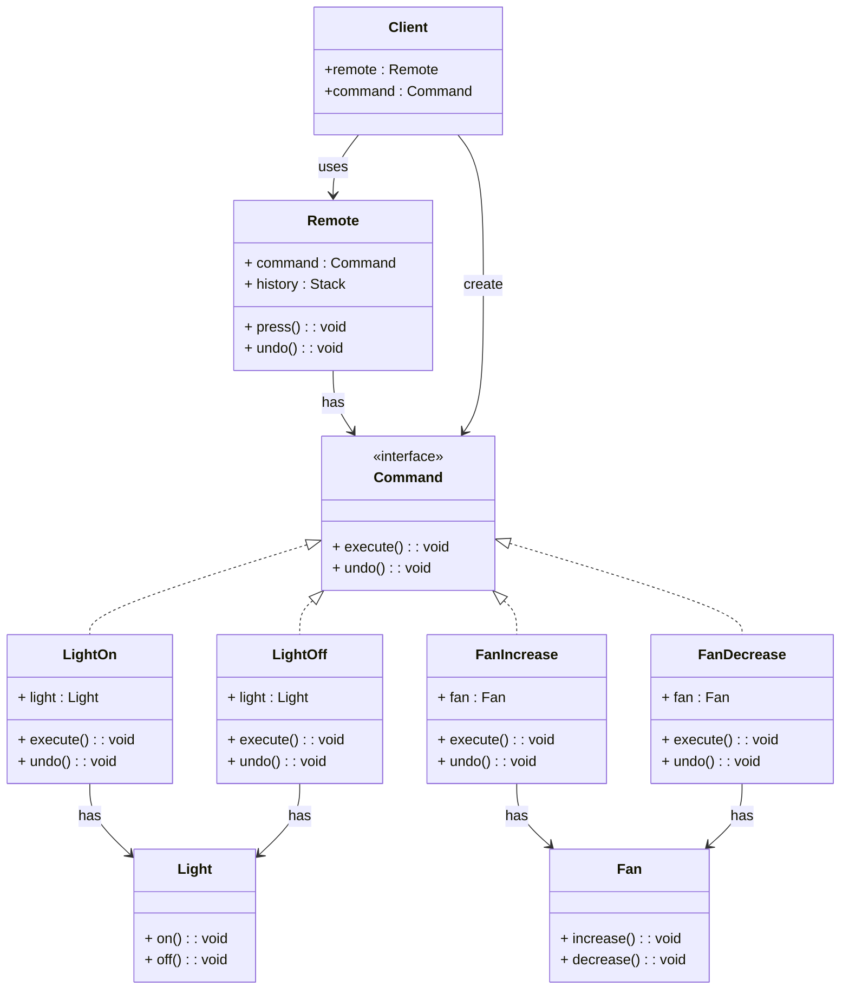

# 📌 Design Pattern: [Command]

---

## ✅ 1️⃣ Definition (in your words)

✏️  The **Command Pattern** is a **behavioral design pattern** that encapsulates a request as an object. It **decouples the sender (invoker) from the receiver**, allowing requests to be parameterized, queued, logged, or undone. This makes the system **scalable for adding new commands** without changing existing code.

---

## 🎯 2️⃣ Intent

- Decouple **invoker** and **receiver**.
- Encapsulate requests as **command objects**.
- Support **undo/redo**, **queuing**, or **logging** of requests.
- Make it easy to **add new commands or devices** without modifying existing code.

---

## ⚙️ 3️⃣ When to Use

- When you have **multiple operations/commands**.
- When you need **undo/redo functionality**.
- When commands must be **queued, scheduled, or logged**.
- When you want to **parameterize objects with operations**.

---

## 🚫 4️⃣ When NOT to Use

- When commands are **fixed** and not expected to change.
- When adding the pattern would **unnecessarily complicate simple code**.

---

## 🧩 5️⃣ UML or Sketch

## **Problem: Remote Control for Smart Home Devices**

### **Scenario**

You are building a remote control system for a smart home.

- The remote can control multiple devices: **Lights, Fans, Thermostat, TV**, etc.
- Each device can have multiple actions: `on()`, `off()`, `increase()`, `decrease()`.
- You want to:
    1. **Encapsulate each action as a command**.
    2. Allow the remote to **execute, queue, or undo actions**.
    3. Add new devices without changing the remote logic.

---

---

---

## 📝 6️⃣ Tiny Example (Java)

[DesignPatterns/src/main/java/org/concepts/singleton/SingletonClass.java at main · MehtaJatin/DesignPatterns](https://github.com/MehtaJatin/DesignPatterns/blob/main/src/main/java/org/concepts/singleton/SingletonClass.java)

---

---

## 🧠 7️⃣ Reflection

✅ What was tricky?

✅ How does it connect to real projects?

✅ What would you do differently next time?

---

## 📚 8️⃣ References

- 📖 Link 1: Refactoring Guru
- 📖 Link 2: GeeksforGeeks
- 📖 Link 3: Your GitHub snippet