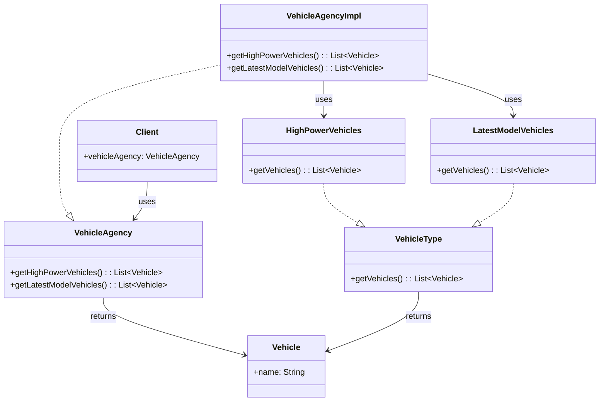

# 📌 Design Pattern: [Facade]

---

## ✅ 1️⃣ Definition (in your words)

✏️   The **Facade Design Pattern** is a **structural pattern** that provides a unified and simplified interface to a set of interfaces in a subsystem. It hides the complexities and allows the client to interact with the system through a single entry point.

---

## 🎯 2️⃣ Intent

- Provide a simpler interface for interacting with a complex subsystem
- Decouple clients from the subsystems
- Hide internal implementation details from the client

---

## ⚙️ 3️⃣ When to Use

- When you want to **hide the complexity** of multiple subsystem classes from the client
- When you need to provide a **single point of interaction**
- When subsystems evolve independently of the client

- Example:
    - Simplifying database connection and query layers
    - Wrapping third-party libraries (e.g., logging, payment, media player SDKs)
    - Simplified API for a complex framework (e.g., Spring, Hibernate)

---

## 🚫 4️⃣ When NOT to Use

- When the subsystem is already simple and doesn't benefit from abstraction
- When overusing it could lead to unnecessary indirection and maintenance burden

---

## 🧩 5️⃣ UML or Sketch

---

## 📝 6️⃣ Tiny Example (Java)

[DesignPatterns/src/main/java/org/concepts/singleton/SingletonClass.java at main · MehtaJatin/DesignPatterns](https://github.com/MehtaJatin/DesignPatterns/blob/main/src/main/java/org/concepts/singleton/SingletonClass.java)

---

---

## 🧠 7️⃣ Reflection

✅ What was tricky?

✅ How does it connect to real projects?

✅ What would you do differently next time?

---

## 📚 8️⃣ References

- 📖 Link 1: Refactoring Guru
- 📖 Link 2: GeeksforGeeks
- 📖 Link 3: Your GitHub snippet