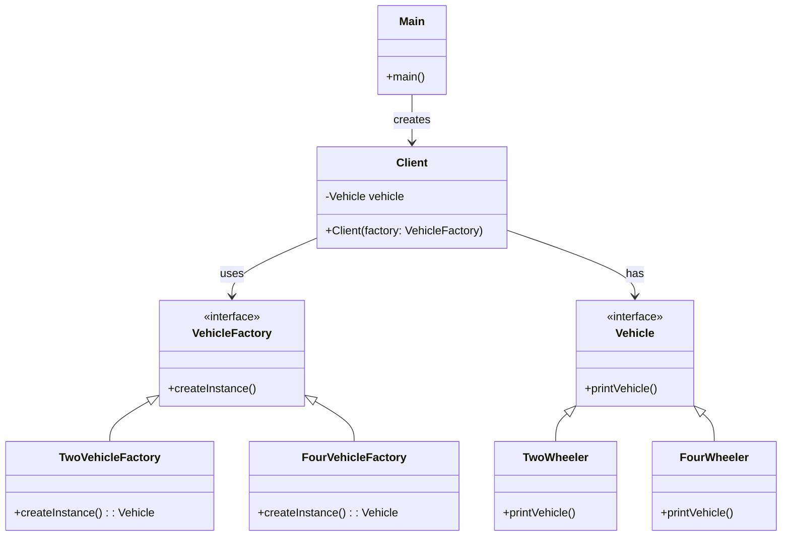

---

## ✅ 1️⃣ Definition (in your words)

✏️ The Factory Design Pattern provides a way to delegate the instantiation of objects to subclasses, allowing the system to be more flexible and adhere to the single responsibility principle.

---

## 🎯 2️⃣ Intent

- Encapsulate object creation logic
- Allow subclasses or factories to decide which object to create
- Enables scalability and flexibility in object creation
- Adheres to the **Open/Closed Principle**

---

## ⚙️ 3️⃣ When to Use

- When instantiating classes is complex or dependent on external configuration
- When you want to centralize control over creation logic
- When client code shouldn’t care about the actual object class

- Example:
  - Logger
  - Spring object creation
  - Connection pool

---

## 🚫 4️⃣ When NOT to Use

- When object creation is simple and unlikely to change
- If it introduces unnecessary abstraction for small-scale code
- If you don’t expect the number of concrete classes to grow

---

## 🧩 5️⃣ UML or Sketch

---

## 📝 6️⃣ Tiny Example (Java)

[DesignPatterns/src/main/java/org/concepts/singleton/SingletonClass.java at main · MehtaJatin/DesignPatterns](https://github.com/MehtaJatin/DesignPatterns/blob/main/src/main/java/org/concepts/singleton/SingletonClass.java)

---

---

## 🧠 7️⃣ Reflection

✅ What was tricky?

✅ How does it connect to real projects?

✅ What would you do differently next time?

---

## 📚 8️⃣ References

- 📖 Link 1: Refactoring Guru
- 📖 Link 2: GeeksforGeeks
- 📖 Link 3: Your GitHub snippet