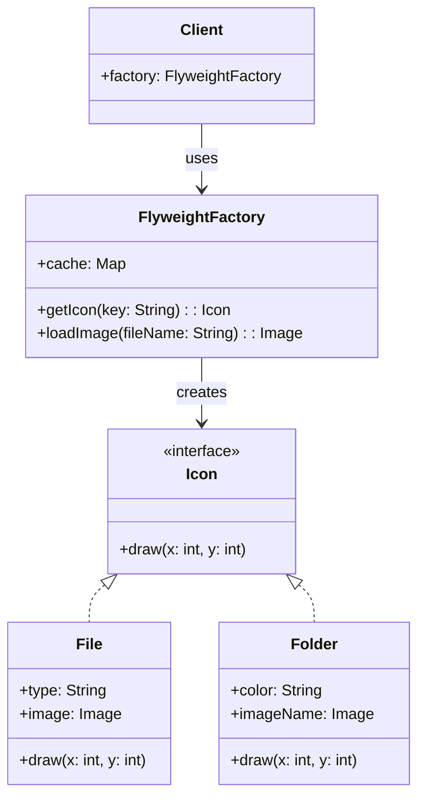

---

## ✅ 1️⃣ Definition (in your words)

✏️   The **Flyweight Pattern** is a **structural design pattern** that **minimizes memory usage** by **sharing as much data as possible** with similar objects. It separates intrinsic (shared) and extrinsic (unique) states.

---

## 🎯 2️⃣ Intent

- Reuse objects with **common/shared properties**.
- Reduce **memory footprint** in systems with **many similar objects**.

---

## ⚙️ 3️⃣ When to Use

- When you have a **large number of similar objects**.
- When memory is a **bottleneck**.
- When objects can **share common parts of their state**.

---

## 🚫 4️⃣ When NOT to Use

- When the number of objects is **small**.
- When **shared state is minimal** or **difficult to extract**.
- When object creation is **not a performance/memory issue**.

---

## 🧩 5️⃣ UML or Sketch

---

## 📝 6️⃣ Tiny Example (Java)

[DesignPatterns/src/main/java/org/concepts/singleton/SingletonClass.java at main · MehtaJatin/DesignPatterns](https://github.com/MehtaJatin/DesignPatterns/blob/main/src/main/java/org/concepts/singleton/SingletonClass.java)

---

---

## 🧠 7️⃣ Reflection

✅ What was tricky?

✅ How does it connect to real projects?

✅ What would you do differently next time?

---

## 📚 8️⃣ References

- 📖 Link 1: Refactoring Guru
- 📖 Link 2: GeeksforGeeks
- 📖 Link 3: Your GitHub snippet