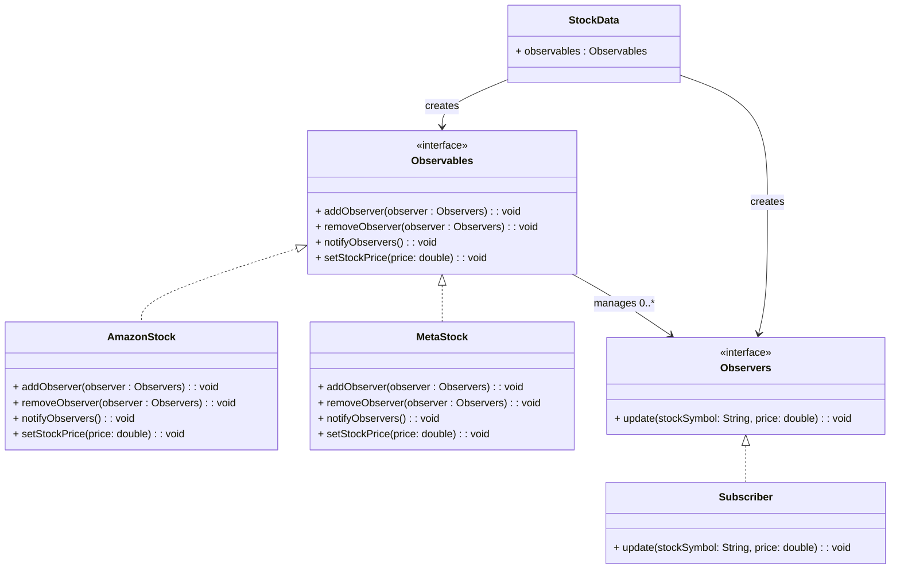

# 📌 Design Pattern: [Observer]

---

## ✅ 1️⃣ Definition (in your words)

✏️   The **Observer Pattern** is a behavioral design pattern that establishes a one-to-many dependency between objects so that when one object (the Observable) changes its state, all its dependent objects (Observers) are notified and updated automatically.

---

## 🎯 2️⃣ Intent

- Enable an object (Observable) to notify multiple dependent objects (Observers) of state changes.
- Facilitate loose coupling between the Observable and its Observers.
- Support dynamic subscription and unsubscription of Observers at runtime.

---

## ⚙️ 3️⃣ When to Use

- When one object’s state change must be reflected in multiple other objects.
- When the number and types of observers can change dynamically.
- To decouple subject and observers, allowing them to evolve independently.

---

## 🚫 4️⃣ When NOT to Use

- When observers are fixed and not expected to change.
- When introducing the pattern would add unnecessary complexity to a simple scenario.

---

## 🧩 5️⃣ UML or Sketch

You’re designing a **stock price tracking system**.

1. There’s a **StockData** class that **continuously updates stock prices** for multiple companies (e.g., Apple, Tesla, Amazon).
2. Multiple **subscribers (observers)** can register themselves to get notified when **a stock they care about** changes price.
3. Each subscriber can have **different interests**:
    - **EmailAlertService** → sends email when the price changes more than **5%**.
    - **MobileAppService** → shows a push notification for **every change**.
    - **AnalyticsDashboard** → updates its internal graph for **every change**, but only for selected stocks.
4. Observers should be able to:
    - **Subscribe** and **unsubscribe** dynamically.
    - Receive **only relevant updates** (not every single change for all stocks).
5. The system should be **extensible** — adding a new type of alert service should not require modifying **StockData**.

---

### 

---

## 📝 6️⃣ Tiny Example (Java)

[DesignPatterns/src/main/java/org/concepts/singleton/SingletonClass.java at main · MehtaJatin/DesignPatterns](https://github.com/MehtaJatin/DesignPatterns/blob/main/src/main/java/org/concepts/singleton/SingletonClass.java)

---

---

## 🧠 7️⃣ Reflection

✅ What was tricky?

✅ How does it connect to real projects?

✅ What would you do differently next time?

---

## 📚 8️⃣ References

- 📖 Link 1: Refactoring Guru
- 📖 Link 2: GeeksforGeeks
- 📖 Link 3: Your GitHub snippet