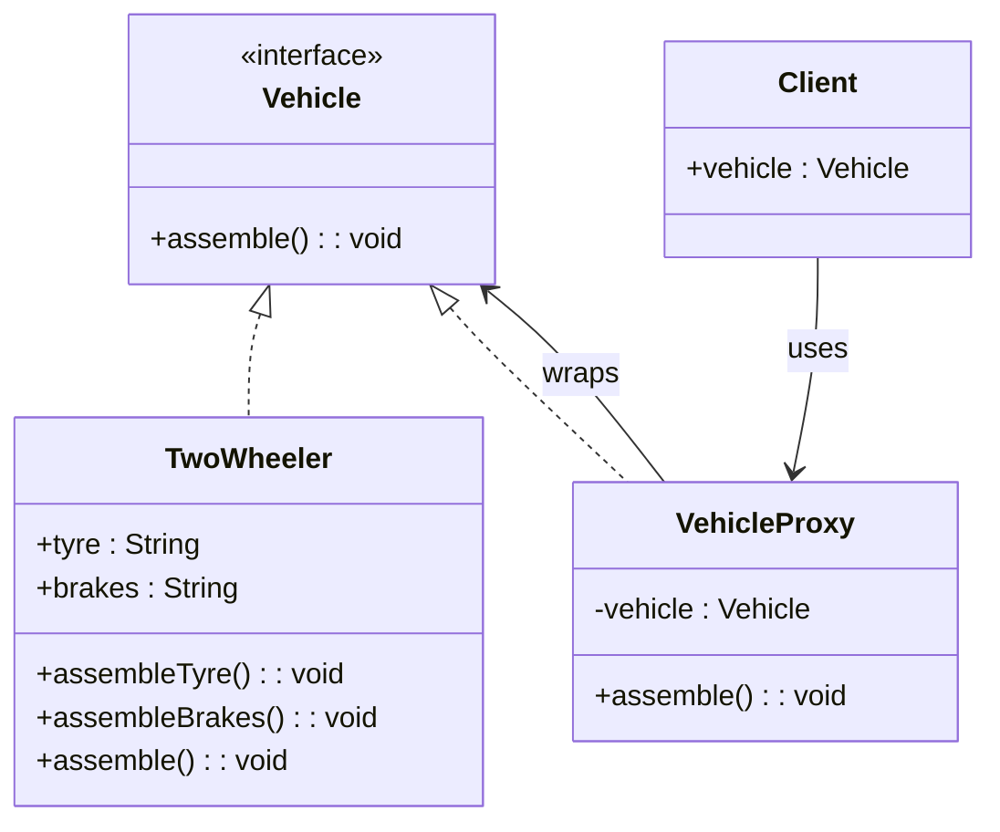

# 📌 Design Pattern: [Proxy]

---

## ✅ 1️⃣ Definition (in your words)

✏️   The Proxy Design Pattern is a **structural pattern** that intercepts requests to control access to a real object.

---

## 🎯 2️⃣ Intent

- Restrict access to real object directly.
- Enabling different functionality and improvement before the real business logic execution

---

## ⚙️ 3️⃣ When to Use

- When Lazy loading, access control, performance improvement like caching, logging etc. required

- Example:
    - Spring interceptors and filters
    - Load balancing or logging etc.
    - **Spring AOP Proxies**
    - **Hibernate Lazy Loading**
    - **Virtual proxies for image loading**
    - **Remote proxies for RPC systems**

---

## 🚫 4️⃣ When NOT to Use

- When creating a lot of complexity
- No extra functionality required like logging, caching etc.

---

## 🧩 5️⃣ UML or Sketch

---

## 📝 6️⃣ Tiny Example (Java)

[DesignPatterns/src/main/java/org/concepts/singleton/SingletonClass.java at main · MehtaJatin/DesignPatterns](https://github.com/MehtaJatin/DesignPatterns/blob/main/src/main/java/org/concepts/singleton/SingletonClass.java)

---

---

## 🧠 7️⃣ Reflection

✅ What was tricky?

✅ How does it connect to real projects?

✅ What would you do differently next time?

---

## 📚 8️⃣ References

- 📖 Link 1: Refactoring Guru
- 📖 Link 2: GeeksforGeeks
- 📖 Link 3: Your GitHub snippet